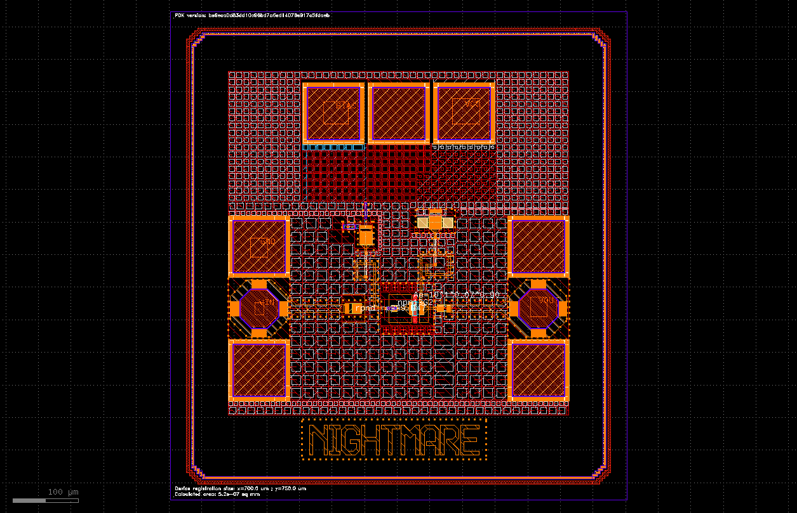

# 🚀 60 GHz Power Amplifier – Tapeout Project (IHP SG13G2)

Welcome to the tapeout repository for a **60 GHz Power Amplifier**, designed in **IHP’s SG13G2 BiCMOS technology**.

This project is an **extension of the** [IHP Analog Academy](https://github.com/IHP-GmbH/IHP-AnalogAcademy), created to **verify and validate the analog design flow** through an actual tapeout and future silicon measurements.

While the **complete design methodology** (including schematic, layout, EM simulation, and post-layout analysis) is detailed in the Analog Academy repository, this repo contains:
- The **Non linear simulation setup (with description from analog academy)**
- **OpenEMS simulation setup for the BJT core**
- **Adapted layout** 
used to validate and expand upon the original design flow.

Check especially [module 2](https://github.com/IHP-GmbH/IHP-AnalogAcademy/tree/main/modules/module_2_50GHz_MPA):
- `part 3` non linear analysis
- `part 4` Open EMS

## 👥 Contributors

- **Phillip Ferreira Baade-Pedersen** – [GitHub](https://github.com/PhillipRambo) (IHP)
- **Giovanni Di Pietrantonio** – [GitHub](https://github.com/giove11) (IHP)
