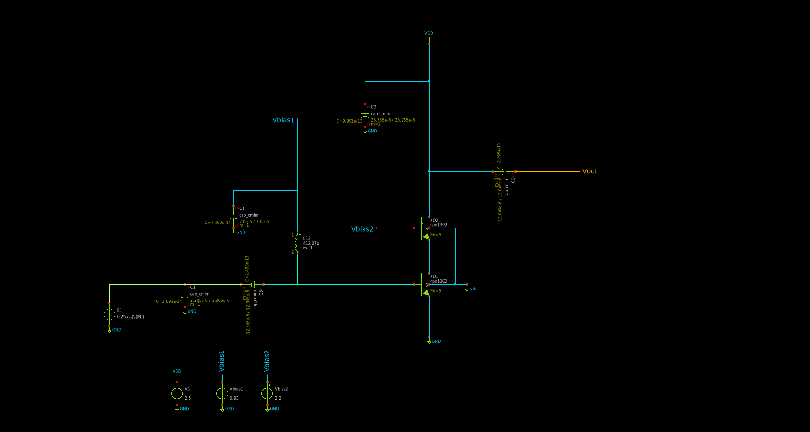

Specifications of the design
================

+----------------+------------------+
| Specifications | Values (122 GHz) | 
+================+==================+
| Gain           | 15.3 dB          | 
+----------------+------------------+
| NF             | 5.4 dB           | 
+----------------+------------------+
| S11            | -26.2 dB         | 
+----------------+------------------+
| S22            | -26.5 dB         | 
+----------------+------------------+
| DC consumption | 27 mW            | 
+----------------+------------------+

The aim of this project is the conception of 122 GHz LNA (Low Noise Amplifier). The design of transmission lines has enabled the adaptation allowing to reach the performances exposed in the above table. 

Schematic of the designed LNA:

Bias voltage  

+-----------+-----------+-------+
| Vbias1    | Vbias2    |  VDD  |
+===========+===========+=======+
|  2.2 V    |  0.93 V   | 2.5 V | 
+-----------+-----------+-------+
