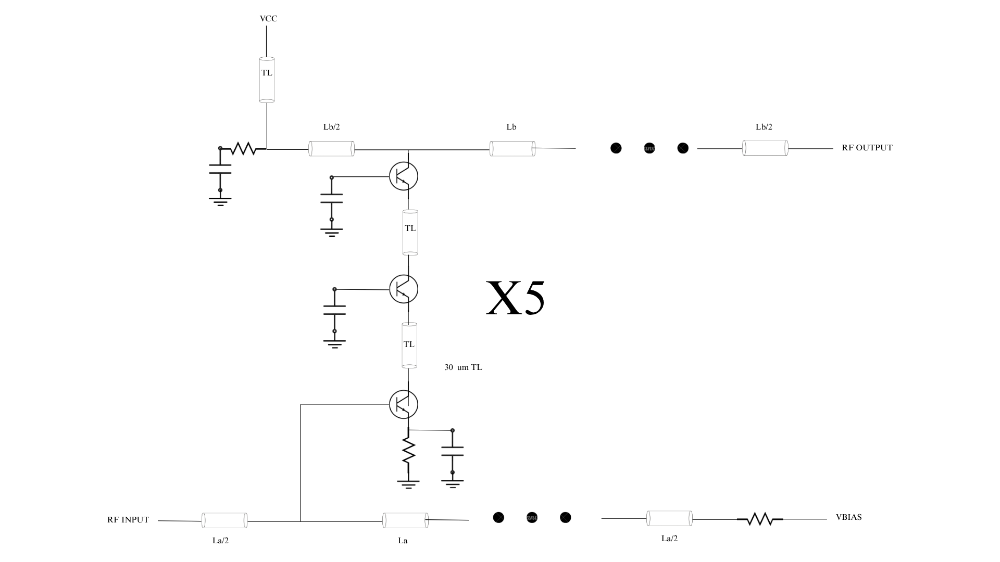
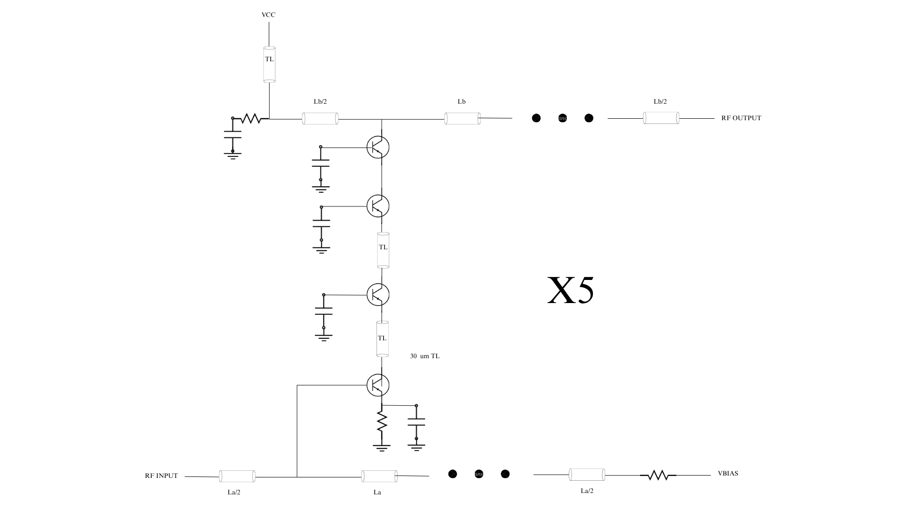
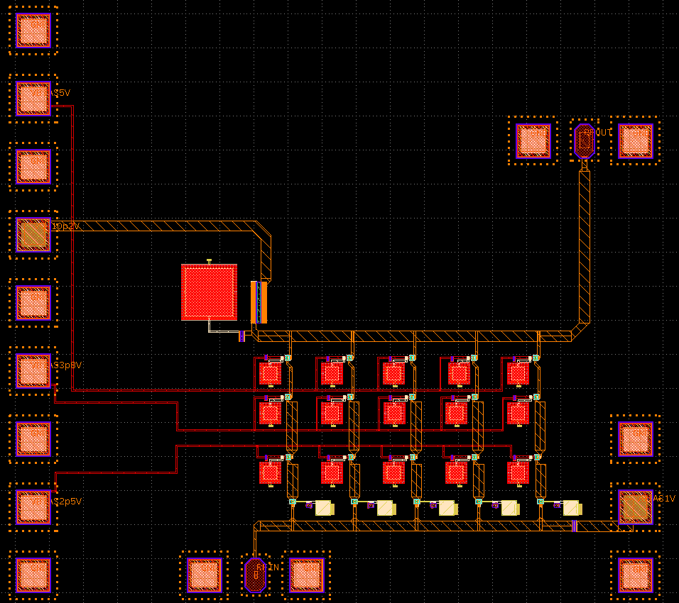

Design data and design process description
############################################

Tricode 
########################################

Fig 1 - Schematic
 
.. image:: _static/Tricode_DA.png
    :align: center
    :alt: IHP Logo Image.
    :width: 800
    :height: 800

Fig 2 - DA GDS View

.. image:: _static/Tricode_Distributed_Amplifier.png
    :align: center
    :alt: IHP Logo Image.
    :width: 800
    :height: 800

Fig 3 - GDS Filled

Quadcode
#########################################################

Fig 4 - QUadcode Schematic

Fig 5 - GDS View

.. image:: _static/Quadcode_DA_full.PNG
    :align: center
    :alt: IHP Logo Image.
    :width: 1000
    :height: 800

Fig 6 - Full GDS 