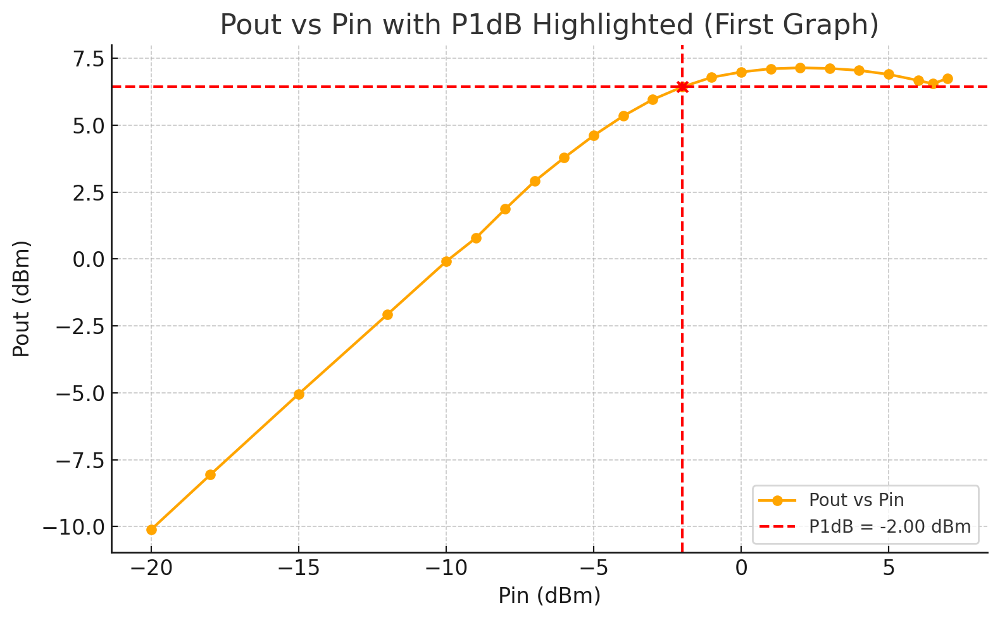
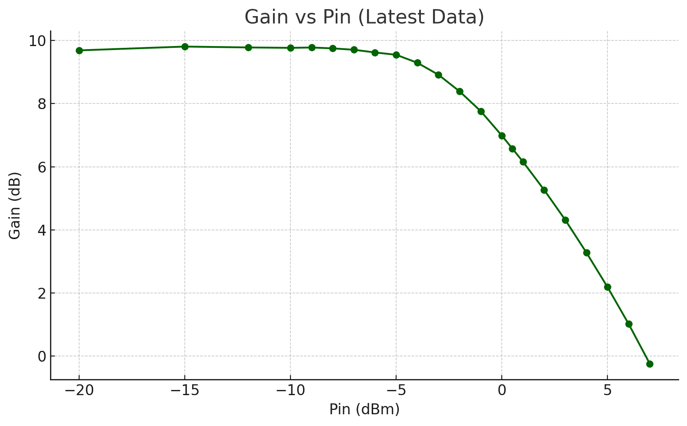
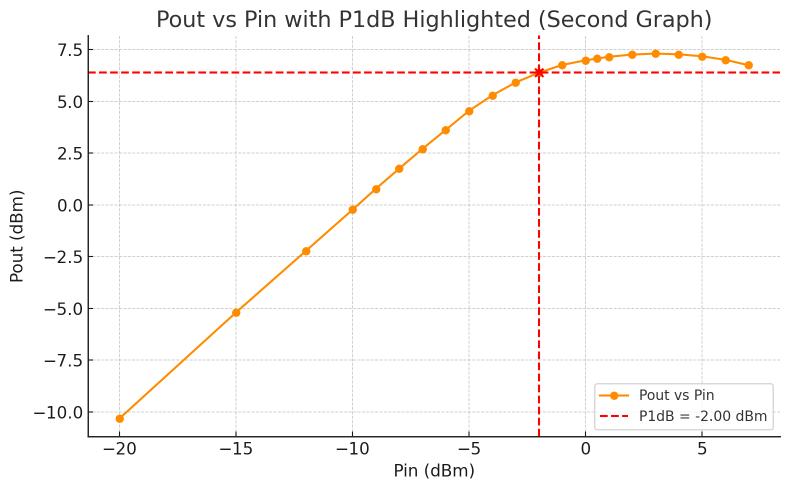
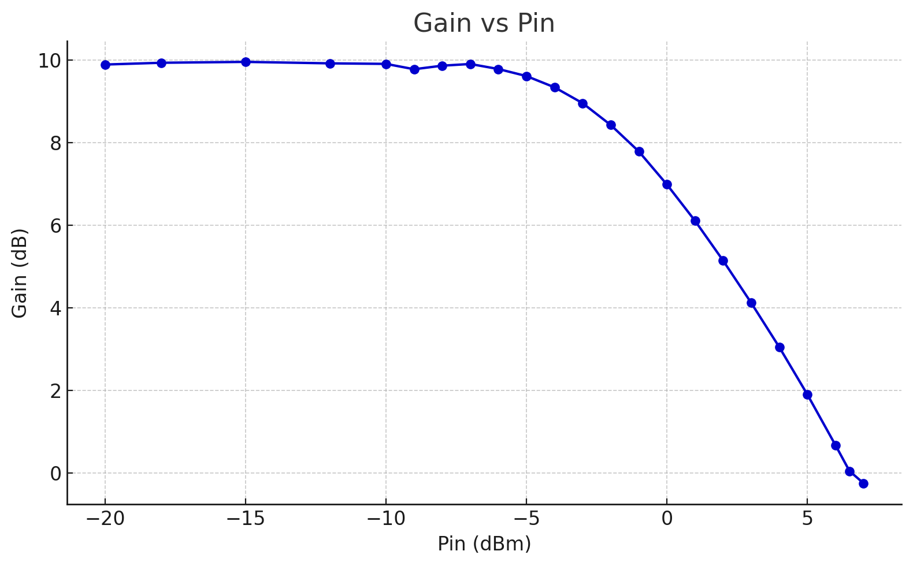

Validation  of the Design
#################################

Simulated Result
#######################################
Tricode
--------------------------------

##########################################

############################################

#################################################

Quadcode
##############################################

######################################################

#######################################################

######################################################

*Measurement Awaits*
########################################################