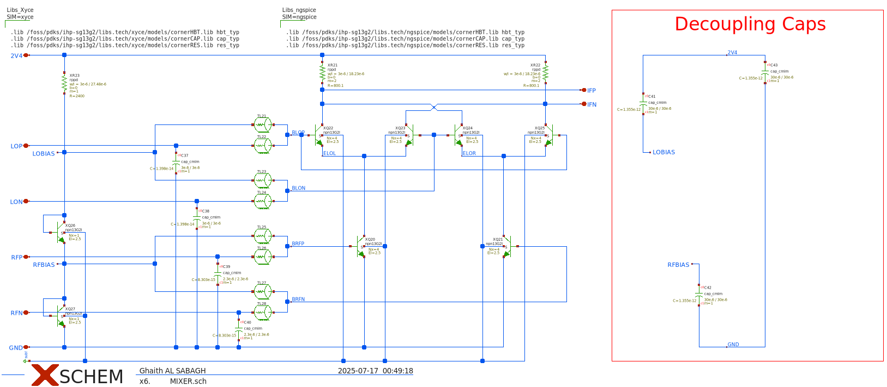
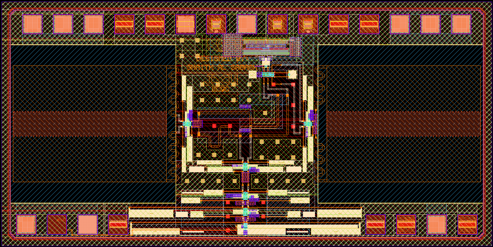

Specification of the mWATTBAT
###################################

Abstract:  
=============  
mWATTBAT is an open source FMCW Radar Chip which is designed using the SG13G2 open source PDK from IHP.  
This short range RADAR should be able to measure distance and velocity of objects from a distance of one meter.  
The SoC would have 10 GHz SE-Input, 3 different supply voltages, TX/RX signals centered around 150 GHz, on chip differential antennas and in MHz-range analog IF-Output.  
The whole design peocedure was fully done with open source tools using xyce, ngspice, openEMS, xschem and KLayout.  
The whole chip is 2mm x 1mm!
  
Block Diagram:  
=============  

	
Schematics:  
=============

Multiplier 10GHz to 50 GHz:  
-------------  

RF Amplifier 50 GHz:  
-------------  

	
Multiplier 50GHz to 150 GHz:  
-------------  

	
RF Amplifier 150 GHz:  
-------------  

	
Differential Wilkinson Divider 150 GHz:  
-------------  

	
Mixer:  
-------------  

	
IF Amplifier:  
-------------  

	
Layout:  
=============  

	
The rest of documentation would be carried on later ...
=============